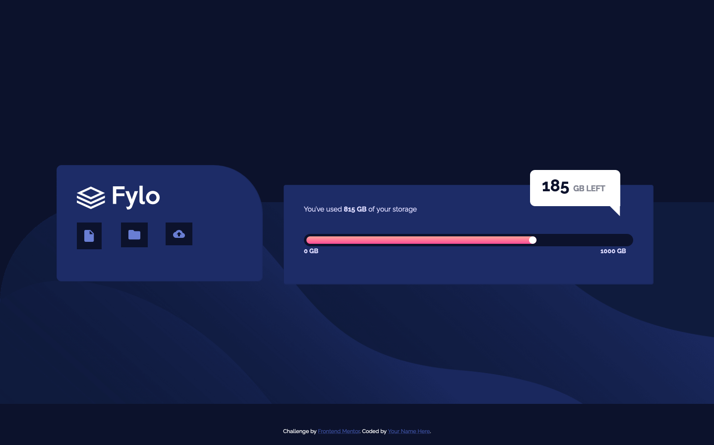
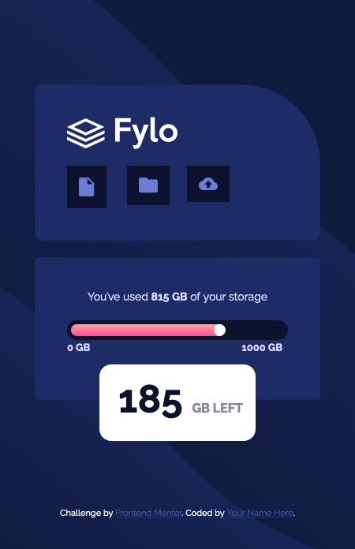

# Frontend Mentor - Fylo data storage component solution

This is a solution to the [Fylo data storage component challenge on Frontend Mentor](https://www.frontendmentor.io/challenges/fylo-data-storage-component-1dZPRbV5n). Frontend Mentor challenges help you improve your coding skills by building realistic projects. 

## Table of contents

- [Overview](#overview)
  - [The challenge](#the-challenge)
  - [Screenshot](#screenshot)
  - [Links](#links)
- [My process](#my-process)
  - [Built with](#built-with)
  - [What I learned](#what-i-learned)
  - [Continued development](#continued-development)
  - [Useful resources](#useful-resources)
- [Author](#author)

## Overview

### The challenge

Users should be able to:

- View the optimal layout for the site depending on their device's screen size

### Screenshot

#### Desktop

#### Mobile

### Links

- Solution URL: [ Solution](https://github.com/rebekahshaw92//fylo-data-storage-component)
- Live Site URL: [Live Site](https://rebekahshaw92.github.io/fylo-data-storage-component/)

## My process

### Built with

- Semantic HTML5 markup
- CSS custom properties
- Sass
- Bootstrap 5
- Mobile-first workflow

### What I Learned

While undertaking this project I learned how to create a number of different items such as a progress bar, cards and a popout.

### Continued development

I want to continue working with bootstrap and learn all I can do with it.

### Userful Resources 

- [Bootstrap]https://getbootstrap.com) - This site helped me learn all I needed to know about Bootstrap.

## Author

- Website - [Rebekah Shaw](https://www.rebekahshaw.com)
- Frontend Mentor - [@rebekahshaw92](https://www.frontendmentor.io/profile/rebekahshaw92)
- Twitter - [@x_beckyboo_x](https://www.twitter.com/x_beckyboo_x)